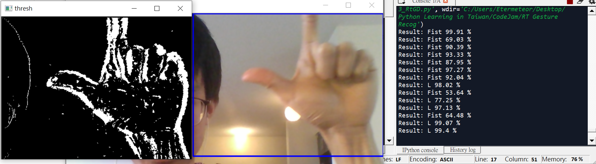

# McGill-CodeJam-2019

This repository includes the source code for our work on a Real-time Gesture Detection system (RtGD). The work is developed with the help of my teammates (Kaiwen Xu, Tom Sarry, and Elsa Emilien) during the McGill CodeJam 2019 event (https://devpost.com/software/mr-bean) which wins the second-place award in the Optional Theme - Internet of Things. I would also want to acknowledge Brenner Heintz (https://github.com/athena15/project_kojak) for his pre-trained hand-gesture model and the inspiration on this project.

This repository will be structured as follow:
<pre>
    1. Our goal for the project.  
    2. Functions for each script.  
    3. Results of the RtGD model.  
    4. Future work and reflections.
</pre>

Note, the code provided here is just the computer vision part of the CodeJam project. For the detailed project description and source code, please refer to the devpost page provided above.

# Our Goal for the Project  
The goal for this project is to develop a RtGD system **having minimum effect on environmental noise**. When compared to the work done by Brenner Heintz, our system is targeted to function properly outside of a dark room. This is tackled by the compibation of a motion detection algorithm (OpenCV) + model retraining on noisy data in our approach. We followed the pretrained model from Brenner's repo and targeted the recognition of the same five gestures, fist, L, okay, palm, and peace, in this project. Examples for the retraining gesture data are shown in the figure below: 

    

# Functions for Each Script  
In this section, I will introduce the function for each scripts and zip file based on my experimental flow. A illustration for the experimental flow is presented below:

<pre>
    1.  pretrain VGG model                 (/models.zip/VGG_cross_validated.h5)  
    2.  record images for downstream task  (1_Record_Image.py) (NewTraining20191216.zip)  
    3.  retrain the model                  (2_Retrain model.py) (retrained_20200506.h5)  
    4.  operate the RtGD system            (3_RtGD.py)
</pre>

The pretrained and retrained models are stored in the model.zip file. If you are interested to record new images for your downstream task, the script provided in (1_Record_Image.py) can serve well for this purpose. The recording script includes a motion detection algorithm that only catches up moving parts and omits environmental noise (ex: lights from the window or lamp). An example of the recorded images, with 20 images for each class, are stored in NewTraining20191216.zip. These images are then applied to retrain our model using the script (2_Retrain model.py). Due to the time limitation in CodeJam competition, we froze the convolution layer of the VGG model and use the recorded images to only retrain the dense layer which has 3252997 trainable parameters.

After retraining on our task, the real-time inference can be operated by running the script (3_RtGD.py); the same motion detection algorithm is also used here. Due to the retraining process, our model can recognize different hand gestures with minimum interference from the environmental light noise. Testing accuracy of 85% is achieved by using the recorded dataset.

# Results of the RtGD Model  
The result of the RtGD model is illustrated in the following figure. The left image shows the processed image after motion detection, while the middle images show the real-time captured data. From the image, we can observe that the RtGD model outputs the gesture in real-time (a gesture of L is demonstrated with a confidential score of 99.40%). Notably, the light sources in the real-time image do not appear after the data is processed by the algorithm. This cancellation of the background noise results in a more robust RtGD system and enable the system to be applied to various environment.

# Future Work and Reflections  
An RtGD system with suppressed background noise is presented in the project. By leveraging on a motion detection algorithm, our retrained model can learn to omit the background light noise and improves its classification accuracy when tackling real-world problems. Although this project shows some promising improvement, some future work can be experimented on to further boost the model performance.

<pre>
    1.  Increase the re-training dataset size. 
    2.  Implemented data argumentation method.  
    3.  Retrain the whole model instead of merely the dense layer.  
    4.  Introduce other moving parts other than hand gesture (ex: moving head...) during training and make the model immune to those noises.
</pre>
